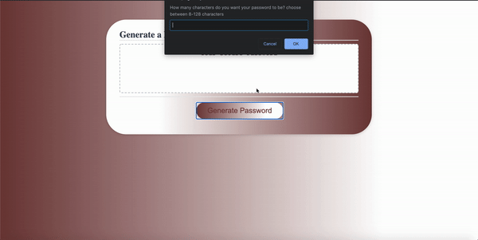

# Password Generator

<h2>Purpose</h2>
A password is randomly generated once the user provide answers to the prompted questions.

Upon launching, the user can click the generate password button. Once the generate password is clicked the user will be asked propmted to answer several questions. If the password is outsite the password length criteria of 8-128 characters. The user will be asked to choose a password length that meet the criteria. Once all criteria have been met, the application will generate a password that will be displayed in the box.

<h2>Tedchnologies used</h2>
    - HTML5
    - CSS3
    -JavaScript

<h2>Difficulties</h2>
I had some difficulties with getting the prompts to the user and ensuring that the application generate a password that fits the users inputs. That presented a challenge that taught me alot.

